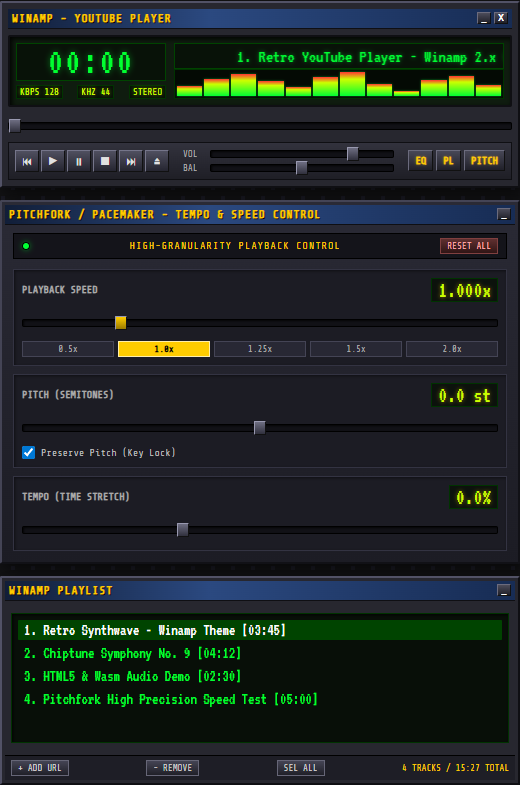

# Winamp YouTube Web Player (with Pitchfork High-Granularity Control)

A retro YouTube audio web player interface replicating the iconic **Winamp 2.x Classic Skin** paired with the **PaceMaker / Pitchfork** DSP plugin for fine-grained audio tempo, speed, and pitch control.

---

## 🎯 Target UI & Design References

This project aims to faithfully duplicate the aesthetic and layout of Winamp 2.x and its classic audio DSP plugins.

### Current UI Prototype
The prototype recreates the classic Winamp main window (dark metallic panels, bevelled buttons, green/yellow LED matrix display, spectrum visualization) alongside a Pitchfork/PaceMaker-style plugin window with high-precision Speed, Pitch, and Tempo sliders, plus a dedicated playlist window (pure audio playback, no video screen display in this iteration).


<br>
*(Live screenshot of the current HTML5/CSS prototype in this repo)*

---

## 🚀 Project Overview & Architecture

### Current Stage: HTML5 / CSS UI Prototype
* **Standalone UI (`index.html`, `styles.css`):** Pixel-styled HTML5 layout mimicking the classic Winamp main window, audio playlist, and Pitchfork plugin deck.
* **Audio-First Design:** Focuses on pure audio playlist playback with no embedded video player screen.
* **Granular Controls:** Speed slider configured for high-precision steps (`0.005x` increments), semitone pitch adjustments, and tempo sliders.

### Planned Stack & Capabilities
* **Rust + WebAssembly (Wasm):** Rust application state management, playlist handling, keyboard shortcuts, and player logic.
* **YouTube playback:** Start with a YouTube video ID or URL entered through the Winamp-style **Open** control. A later iteration may offer YouTube browsing/search, subject to the available YouTube APIs and their authentication, quota, and usage requirements.
* **Audio-first presentation:** The player can present YouTube playback as an audio-focused experience while retaining the underlying supported YouTube player. Extracting and redistributing raw YouTube audio is not assumed to be part of this project.
* **Playback controls:** The YouTube IFrame Player API can provide supported playback-rate controls, but it does not guarantee arbitrary floating-point rates. Pitch and tempo processing may therefore require an approved playback pipeline or a separate DSP layer rather than direct cross-origin iframe manipulation.
* **Optional browser extension interop:** A browser extension could report which tabs are marked audible through the WebExtensions `tabs` API in Chromium-based browsers and Firefox. This is useful for discovery and companion features, but it does not expose exact audio routing or the individual audio element responsible for sound.
* **Desktop window behavior:** HTML/CSS can make the player surface translucent, but a normal browser page cannot make its outer browser window transparent or define OS-level click-through regions. True transparent-window behavior requires a desktop wrapper or native host such as Electron, Tauri, WinUI, WPF, or WinForms.

### Product Direction
The goal is a compact, keyboard-friendly HTML5 Winamp experience for YouTube listening:

1. Click **Open** and paste a YouTube URL or video ID.
2. Resolve the input into a playable YouTube item and add it to the playlist.
3. Play it through the classic Winamp-style transport and playlist controls.
4. Keep the first iteration audio-focused, with video display and browsing treated as later additions.

The browser and extension APIs can help identify audible tabs, but they cannot universally identify the exact YouTube tab from Windows audio alone. If that capability becomes important, the application will need browser-specific extension integrations plus a native or desktop-wrapper component.

---

## 🖥️ How to Preview the UI

Simply open `index.html` in any web browser:

```bash
# Double-click index.html or open via local HTTP server
npx serve .
# or
python3 -m http.server 8000
```

---

## 📁 Repository Structure

```
winamp-youtube-player/
├── index.html        # HTML5 layout of Winamp & Pitchfork UI
├── styles.css        # Retro Winamp classic skin stylesheet
├── screenshot-ui.png # Screenshot of the current UI prototype
└── README.md         # Project documentation & reference images
```
